**[Portfolio](https://a-saeedia.github.io) · [Blog](https://generative-waves.ca) · [A Corp](https://generative-waves.sa) · [Telegram](https://t.me/cyberalchemistt)**

ساختِ ربات‌ها و ابزارهای خودکار — با Python، TypeScript و Cloudflare

### Sigils

| Project | Stack | Stars | What it is |
|---|---|---|---|
| [agent-bridge](https://github.com/a-saeedia/agent-bridge) | JavaScript |  | Local hub connecting AI programs (OpenCode, Hermes, FreeBuff, OpenHand) over JSON WebSocket: publish/subscribe, RPC delegation, file-drop bridge for no-API agents. |
| [bource-mcp](https://github.com/a-saeedia/bource-mcp) | JavaScript |  | Read-only MCP bridge for the Iran Bourse. Live TSETMC market data plus a hard-guarded authenticated TSE portal session. GET-only by design: no write tools exist. |
| [creative-lemon](https://github.com/a-saeedia/creative-lemon) | TypeScript |  | An MCP server that gives AI agents eyes for creating: 2026 web-design trends, scroll-motion recipes, palettes, type systems, critique and DESIGN.md tokens. |
| [multi-agent-workspace](https://github.com/a-saeedia/multi-agent-workspace) | JavaScript |  | Cloudflare Workers workspace: Telegram funnel bot, AI video-editing pipeline (FFmpeg + vision), KV-backed multi-agent orchestration — all on workers.dev. |
| [vedits](https://github.com/a-saeedia/vedits) | Python |  | Zero-budget, FFmpeg-powered social video editor. Pure Python stdlib — presets for TikTok/Reels/Shorts, captions, concat, CapCut-style web GUI. |
| [v0-ai-academy-prompt-library](https://github.com/a-saeedia/v0-ai-academy-prompt-library) | TypeScript |  | AI Academy prompt library — Next.js app generated from v0.app, deployed on Vercel. |

### Systems

### Ledger

<picture>
  <source media="(prefers-color-scheme: dark)" srcset="https://raw.githubusercontent.com/a-saeedia/a-saeedia/output/github-contribution-grid-snake-dark.svg" />
  <source media="(prefers-color-scheme: light)" srcset="https://raw.githubusercontent.com/a-saeedia/a-saeedia/output/github-contribution-grid-snake.svg" />
  
</picture>

